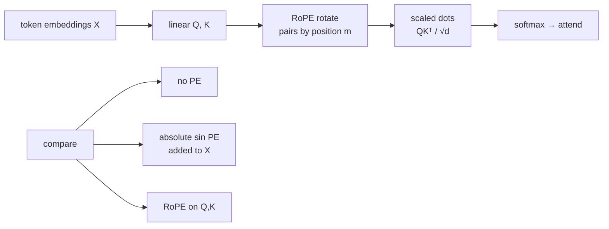

# ai-learn-26-rope-embeddings

**Rotary Position Embeddings (RoPE)** from scratch in NumPy — the relative-position scheme used by RoFormer, LLaMA, GPT-NeoX, and most modern LLMs. Natural follow-up to `ai-learn-02` (absolute sinusoidal PE) and `ai-learn-01` (attention).

Part of the AI learning series (after `ai-learn-25-speculative-decoding`).

## Architecture



## What you'll learn
- How RoPE rotates each `(x_{2i}, x_{2i+1})` pair by angle `m · θ_i` with `θ_i = 10000^{-2i/d}`.
- Why `<RoPE(q, m), RoPE(k, n)>` depends only on the **relative** offset `(m − n)`.
- Relative-shift invariance: shifting all positions by Δ leaves RoPE attention logits unchanged (absolute PE does not).
- On a relative-offset retrieval task with content-matched distractors, RoPE beats absolute sinusoidal PE and no-PE.
- How modern LLMs inject position into attention without adding a PE vector to embeddings.

## Layout
| file | purpose |
|---|---|
| `rope.py` | Frequencies, `apply_rope`, relative-property checks, sinusoidal PE helper |
| `attention.py` | Tiny single-head NumPy attention (`none` / `absolute` / `rope`) |
| `experiments.py` | Shift invariance, closed-form scores, relative-offset train loop |
| `run_smoke.py` | Deterministic smoke (seed 42) → `results/` |
| `smoke_plots.py` | SVG plots + RESULTS.md writer |
| `svg_utils.py` | Minify matplotlib SVGs for clean diffs |
| `notebooks/rope_embeddings.ipynb` | Step-by-step walkthrough |
| `results/` | `RESULTS.md`, `metrics.json`, `JSON.shot`, SVG plots |

## Run
```bash
pip install -r requirements.txt
python run_smoke.py          # ~1 s on CPU, seed 42, writes results/
jupyter notebook notebooks/rope_embeddings.ipynb
```

## Results (seed 42, from `results/metrics.json`)
| check | no PE | absolute sin | RoPE |
|---|---|---|---|
| shift-invariance cosine | 1.0 | 0.851 | **1.0** |
| relative-offset top-1 acc | 0.25 | 0.797 | **0.973** |
| attn mass on target | 0.137 | 0.666 | 0.323 |
| wall time | — | — | **~1.0 s** CPU |

Relative property: max abs-vs-rel error ~1e-14 (pass). Absolute PE score variance across placements of the same offset ≈ 3.83 (RoPE = 0 by construction).

See [results/RESULTS.md](results/RESULTS.md) for full tables and plots.

## Caveats
- Toy single-head attention and a synthetic relative-offset task — not a full Transformer / LM.
- Softmax uses an educational `logit_scale` so peaks are visible; ranking metrics use the same scores.
- Absolute PE can look sharper (higher mass) when it is right, but generalizes worse across random placements.

## Next steps
- Multi-head RoPE + causal LM on the mini-transformer from `ai-learn-04`.
- NTK-aware / YaRN-style context extension of RoPE frequencies.
- ALiBi vs RoPE head-to-head on the same relative task.
