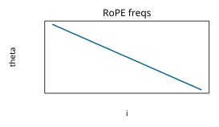
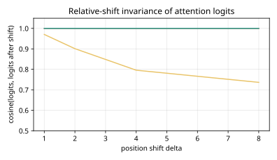
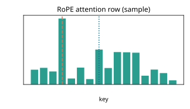
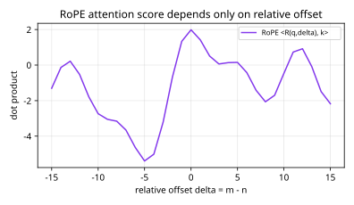

# Results: ai-learn-26-rope-embeddings

Real output of `python run_smoke.py` (seed 42, CPU, 1.04 s wall time).

## Setup
- d_model=32, seq_len=16, RoPE base=10000.0, relative offset=4.
- Relative-offset retrieval: 3 content-matched distractors; query/source placement varies so absolute slot memorization fails.
- Tiny single-head NumPy attention; train Q/K for 180 steps, logit_scale=8.0.

## Relative property check
- max |<RoPE(q,m),RoPE(k,n)> − <RoPE(q,m−n),k>| = **7.11e-15**
- max shift-invariance error = **1.42e-14** → pass=True

## Relative-shift invariance (attention logits cosine after +Δ)
| PE | mean cosine | min cosine |
|---|---|---|
| no PE | 1.0 | 1.0 |
| absolute sin | 0.850876 | 0.736554 |
| RoPE | 1.0 | 1.0 |

## Relative-offset retrieval (test)
| PE | top-1 acc | attn mass | logit gap |
|---|---|---|---|
| no PE | **0.25** | 0.1365 | -0.0032 |
| absolute sin | **0.7969** | 0.6661 | 0.1569 |
| RoPE | **0.9727** | 0.3233 | 0.0872 |

## Headline
- RoPE relative invariance cosine: **1.0** (absolute sin: 0.850876).
- Task accuracy: RoPE **0.9727** > absolute **0.7969** > no-PE **0.25** (chance 0.0625).
- Closed-form: absolute PE score variance across placements of the same offset = **3.832697** (RoPE variance = 0 by construction).

## Plots
- 
- 
- 
- 
- 

## Notes
- Softmax uses an educational logit_scale so peaks are visible; rankings use the same scores.
- Toy single-head attention, not a full Transformer — the RoPE math is the real one.
